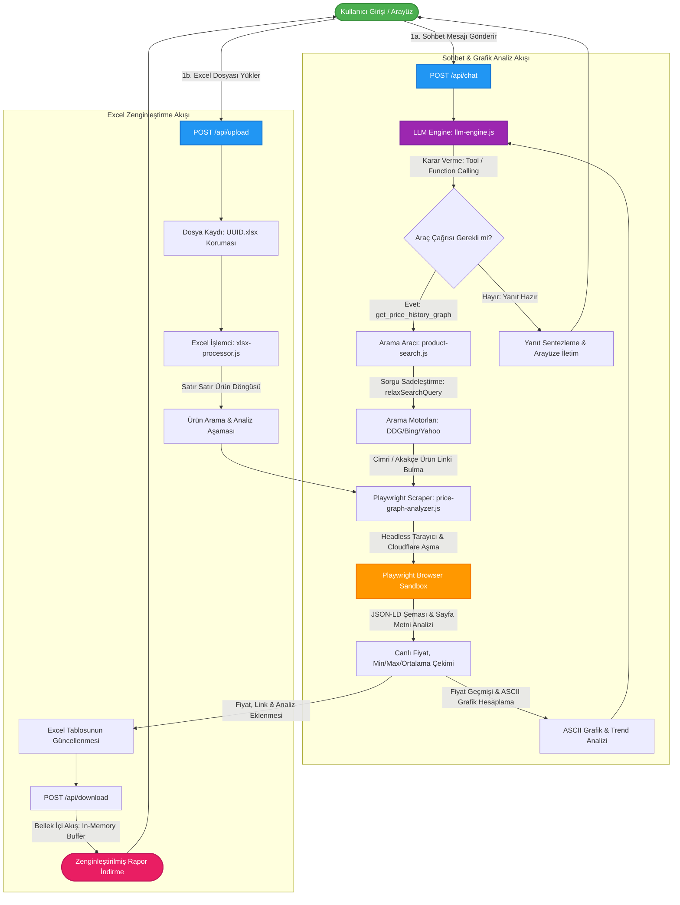

# 📊 PazarPusulası AI - Proje Akış Diyagramı (Mermaid Kodu & Açıklaması)

Bu dosyayı açarak akış şemasını kopyalayabilir veya görsel olarak indirebilirsiniz.

---

## 🎨 Diyagramı Resim (PNG / SVG) Olarak İndirme
Aşağıdaki kutuda bulunan **Mermaid kodunu** tamamen kopyalayıp [Mermaid Live Editor](https://mermaid.live/) sitesine yapıştırarak şemayı anında **PNG, SVG veya PDF** olarak bilgisayarınıza indirebilir, staj raporunuza doğrudan resim olarak ekleyebilirsiniz.

---

## 💻 Kopyalanabilir Mermaid Diyagram Kodu

---

## 🔍 Proje Çalışma Mantığı Açıklaması

### 1. Sohbet ve Canlı Fiyat Analiz Döngüsü (ChatFlow)
1. **Mesaj Alımı:** Kullanıcı bir ürünün fiyatını veya grafiğini istediğinde istemci Express.js'teki `/api/chat` endpoint'ine istek atar.
2. **LLM Niyet Analizi:** `llm-engine.js`, kullanıcının amacını belirler. Eğer ürün fiyatı isteniyorsa otonom olarak `get_price_history_graph` aracını tetikler.
3. **Ürün Arama & Sadeleştirme:** `product-search.js` üründeki gereksiz kelimeleri filtreler, arama motorlarında arar ve Cimri veya Akakçe karşılaştırma sayfa linkini bulur.
4. **Playwright ile Kazıma:** Bulunan link Playwright tarayıcı motoruna gönderilir. Arka planda açılan tarayıcı, Cloudflare engelini aşar. Sayfadaki yapısal JSON-LD verilerini ve metinleri tarar; canlı fiyatı, en düşük, en yüksek ve ortalama fiyatı çeker.
5. **Grafik & Yorumlama:** Alınan veriler `calculatePriceHistory` fonksiyonuna beslenir. Burada 90 günlük dalgalanma grafiği oluşturulur ve ASCII grafik çizilir. LLM bu grafiği yorumlayarak kullanıcıya nihai analizi sunar.

### 2. Excel Zenginleştirme Döngüsü (ExcelFlow)
1. **Yükleme:** Kullanıcı Excel ürün listesini `/api/upload` rotasına gönderir.
2. **Güvenli Saklama:** Sunucu, dosya adını UUIDv4 ile değiştirerek diske güvenli şekilde yazar.
3. **Satır Satır İşleme:** `xlsx-processor.js` Excel'i okur. Her satırdaki ürün için yukarıdaki Arama ve Playwright kazıma süreçlerini çalıştırır.
4. **Zenginleştirme ve İndirme:** Ürünlerin yanına yeni kolonlar (Güncel Fiyat, Min Fiyat, Max Fiyat, Link, Analiz Yorumu) eklenir. Güncellenmiş Excel tablosu, diskte kalıcı dosya yaratılmadan bellek içi akış (`In-Memory Buffer`) aracılığıyla doğrudan kullanıcıya indirilir.
